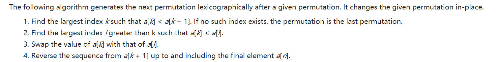

#### 阶乘后的零-172

给定一个整数 *n*，返回 *n*! 结果尾数中零的数量。

```
输入: 3
输出: 0
解释: 3! = 6, 尾数中没有零。

输入: 5
输出: 1
解释: 5! = 120, 尾数中有 1 个零.
```

**思路：**

不断除以 5，是因为每间隔 5 个数有一个数可以被 5 整除， 然后在这些可被 5 整除的数中， 每间隔 5 个数又有一个可以被 25 整除，故要再除一次， 直到结果为 0，表示没有能继续被 5 整除的数了。

其实末尾有多少个 0，取决于到该阶乘的最大直为止，一共有多少"5的整数次幂"； 比如对于50，有50/5 =10个 5的一次方；有 50 / 25 = 2 个 5 的二次方，所以总计有 10 + 2 = 12 个0。

```java
class Solution {
    public int trailingZeroes(int n) {
        int count = 0;
        while(n >= 5) {
            count += n / 5;
            n /= 5;
        }
        return count;
    }
}
```


#### 计算质数-204

统计所有小于非负整数 *n* 的质数的数量。

```
输入: 10
输出: 4
解释: 小于 10 的质数一共有 4 个, 它们是 2, 3, 5, 7 。
```

**思路：**如求10之内的质数，首先列出2~N-1的所有数，如果当前数为质数，则其倍数就是质数，如

第一个质数为2，在2上画圈，其倍数4/6/8不是质数，划掉4/6/8，继续遍历
下一个质数为3，在3上画圈，其倍数6/9不是质数，划掉6/9，继续遍历
下一个质数为5，在5上画圈，没有倍数，继续遍历
下一个质数为7，在7上画圈，没有倍数，继续遍历。
最后再次遍历整个数组，画圈的数字就是质数，即2,3,5,7

转换为代码就是如果需要求 < n 的所有质数个数，则创建一个长度为n的整数数组，所有元素值变为 false，false表示对应的索引值为质数，true 表示对应的索引值为非质数。从2开始遍历，如果当前值为 false，则获取其所有倍数，将元素值变为 true（标记为非质数）。


```java
public class Solution {
    public int countPrimes(int n) {
        boolean[] notPrime = new boolean[n];
        int count = 0;
        for (int i = 2; i < n; i++) {
            if (notPrime[i] == false) {
                count++;
                for (int j = 2; i*j < n; j++) {
                    notPrime[i*j] = true;
                }
            }
        }        
        return count;
    }
}
```

```java
class Solution {
    public int countPrimes(int n) {
        boolean[] noPrime = new boolean[n];
        int count = 0;
        for(int i = 2; i < n; i++){
            if(!noPrime[i]){
                for(int j = 2 * i; j < n; j += i){
                    noPrime[j] = true; 
                }
            }
        }
        for(int i = 2; i < n; i++){
            if(!noPrime[i]) count++;
        }
        return count;
    }
}
```


#### 下一个排列-31

实现获取下一个排列的函数，算法需要将给定数字序列重新排列成字典序中下一个更大的排列。如果不存在下一个更大的排列，则将数字重新排列成最小的排列（即升序排列）。必须原地修改，只允许使用额外常数空间。

以下是一些例子，输入位于左侧列，其相应输出位于右侧列。

```
1,2,3 → 1,3,2
3,2,1 → 1,2,3
1,1,5 → 1,5,1
```

**思路：**



翻译过来：

1. 先找出最大的索引 k 满足 nums[k] < nums[k+1]，如果不存在，就翻转整个数组；
2. 再找出另一个最大索引 l 满足 nums[l] > nums[k]；
3. 交换 nums[l] 和 nums[k]，最后翻转 nums[k+1:]。

举个例子：

比如 nums = [1,2,7,4,3,1]，下一个排列是什么？

1. 我们找到第一个最大索引是 nums[1] = 2
2. 再找到第二个最大索引是 nums[5] = 3
3. 交换，nums = [1,3,7,4,2,1]，翻转，nums = [1,3,1,2,4,7]

时间复杂度：O(n)

空间复杂度：O(1)

```java
class Solution {
    public void nextPermutation(int[] nums) {
        if(nums == null || nums.length == 0) return;
        int firstIndex = -1;
        for(int i = nums.length - 2; i >= 0; i--){
            if(nums[i] < nums[i+1]){
                firstIndex = i;
                break;
            }
        }
        if(firstIndex == -1) {
            reverse(nums, 0, nums.length-1);
            return;
        }
        int secondIndex = -1;
        for(int i = nums.length -1; i > firstIndex; i--){
            if(nums[i] > nums[firstIndex]){
                secondIndex = i;
                break;
            }
        }
        swap(nums, firstIndex, secondIndex);
        reverse(nums, firstIndex + 1, nums.length - 1);
    }
    
    public void reverse(int[] arr, int start, int end){
        while(start < end){
            swap(arr, start++, end--);
        }
    }
    
    public void swap(int[] arr, int x, int y){
        int temp = arr[x];
        arr[x] = arr[y];
        arr[y] = temp;
    }
}
```


#### Pow ( x, n ) -50

实现 [pow(*x*, *n*)](https://www.cplusplus.com/reference/valarray/pow/) ，即计算 x 的 n 次幂函数。

```
输入: 2.00000, 10
输出: 1024.00000

输入: 2.00000, -2
输出: 0.25000
解释: 2-2 = 1/22 = 1/4 = 0.25
```

**思路1：**递归

时间复杂度和空间复杂度均为 O ( logN )，

乘法的话，我们不用一次一次的相乘，得到 2 次方后，我们可以直接把 2 次方的结果相乘，就可以得到 4 次方，得到 4 次方的结果再相乘，就是 8 次方了，这样的话就会快很多了。

对于 n 是偶数的情况，x ^ n = x ^ (n/2) * x ^ (n/2)

对于 n 是奇数的情况，x ^ n = x ^ (n/2) * x ^ (n/2)  * x

```java
class Solution {    
    private double fastPow(double x, long n) {
        if (n == 0) {
            return 1.0;
        }
        double half = fastPow(x, n / 2);
        if (n % 2 == 0) {
            return half * half;
        } else {
            return half * half * x;
        }
    }
    public double myPow(double x, int n) {
        long N = n;
        if (N < 0) {
            x = 1 / x;
            N = -N;
        }
        return fastPow(x, N);
    }

}
```

**思路2：**迭代

时间复杂度为 O ( logN )，空间复杂度为 O ( 1 )，

以 x 的 10 次方举例。10 的 2 进制是 1010，然后用 2 进制转 10 进制的方法把它展成 2 的幂次的和。


 

2 进制对应 1 0 1 0，我们把对应 1 的项进行累乘就可以了，而要进行累乘的项也是很有规律，前一项是后一项的自乘。x^8 =  x^4 * x^4 ；

```java
class Solution {
    public double myPow(double x, int n) {
        long N = n;
        if (N < 0) {
            x = 1 / x;
            N = -N;
        }
        double ans = 1;
        double current = x;
        for (long i = N; i > 0; i /= 2) {
            if ((i % 2) == 1) {
                ans = ans * current;
            }
            current = current * current;
        }
        return ans;
    }
}
```

