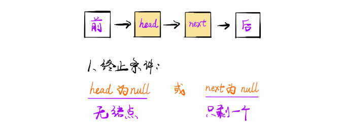
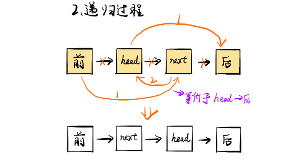
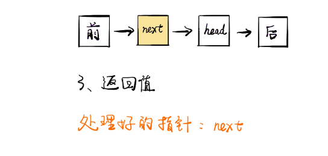
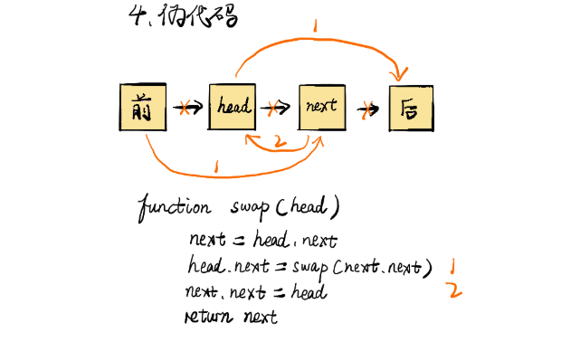

**反转链表**

非递归：next Temp 保存下一个节点，prev 保存前一个节点。

```java
public ListNode reverseList(ListNode head) {
    ListNode prev = null;
    ListNode curr = head;
    while (curr != null) {
        ListNode nextTemp = curr.next; 	//保存下一个节点
        curr.next = prev;	//当前节点指向前一个节点
        prev = curr;		
        curr = nextTemp;
    }
    return prev;
}
```

递归：

```java
public ListNode reverseList(ListNode head) {
    if (head == null || head.next == null) return head;
    ListNode p = reverseList(head.next);
    head.next.next = head;
    head.next = null;
    return p;
}
```


#### 删除链表倒数第 n 个节点

给定一个链表，删除倒数第 n 个节点，返回其头结点。

解答：要删除倒数第 n 个节点，就是删除正数第 l - n + 1个节点，用两个节点，快节点先走 n 步后慢节点开始走，快节点到链表尾时，慢节点刚好在要删除的节点的前一个节点。使用虚拟头结点，方便处理特殊情况。

时间复杂度：O (n)

```java
public class Solution {
    public ListNode removeNthFromEnd(ListNode head, int n) {
        ListNode dummy = new ListNode(0);
        dummy.next = head;
        ListNode first = dummy;
        ListNode second = dummy;
        for(int i = 0; i < n; i++){
            first = first.next;
        }
        while(first.next != null){
            first = first.next;
            second = second.next;
        }
        second.next = second.next.next;
        return dummy.next;
    }
}
```


#### 将链表第m到第n个节点反转

```
输入: 1->2->3->4->5->NULL, m = 2, n = 4
输出: 1->4->3->2->5->NULL
```

实现思路 ：以1->2->3->4->5, m = 2, n = 4 为例:

- 定位到要反转部分的头节点 2，head = 2；前驱结点 1，pre = 1；
- 当前节点的下一个节点3调整为前驱节点的下一个节点 1->3->2->4->5,
- 当前结点仍为2， 前驱结点依然是1，重复上一步操作。。。
- 1->4->3->2->5.

``` java
public class Solution {
    public ListNode reverseBetween(ListNode head, int m, int n) {
        ListNode dummy = new ListNode(0);
        ListNode pre = dummy;
        dummy.next = head;
        for(int i = 1; i < m; i++){
            pre = pre.next;
        }
        head  = pre.next;
        for(int i = m; i < n; i++){
            ListNode tmpNode = head.next;
            head.next = tmpNode.next;
            tmpNode.next = pre.next;
            pre.next = tmpNode;
        }
        return dummy.next;
    }
}
```


#### 两两交换链表中的节点-24

给定一个链表，两两交换其中相邻的节点，并返回交换后的链表。**你不能只是单纯的改变节点内部的值**，而是需要实际的进行节点交换。

```
给定 1->2->3->4, 你应该返回 2->1->4->3.
```

**递归：**









```java
class Solution {
    public ListNode swapPairs(ListNode head) {
        if(head == null || head.next == null){
            return head;
        }
        ListNode temp = head.next;
        head.next = swapPairs(temp.next);
        temp.next = head;
        return temp;
    }
}
```

**迭代：**

```java
class Solution {
    public ListNode swapPairs(ListNode head) {
        ListNode pre = new ListNode(0);
        pre.next = head;
        ListNode temp = pre;
        while(temp.next != null && temp.next.next != null) {
            ListNode start = temp.next;
            ListNode end = temp.next.next;
            temp.next = end;
            start.next = end.next;
            end.next = start;
            temp = start;
        }
        return pre.next;
    }
}
```


#### K 个一组翻转链表-25

给你一个链表，每 k 个节点一组进行翻转，请你返回翻转后的链表。k 是一个正整数，它的值小于或等于链表的长度。如果节点总数不是 k 的整数倍，那么请将最后剩余的节点保持原有顺序。

```
示例 :

给定这个链表：1->2->3->4->5
当 k = 2 时，应当返回: 2->1->4->3->5
当 k = 3 时，应当返回: 3->2->1->4->5
```

**递归：**

```java
class Solution {
    public ListNode reverseKGroup(ListNode head, int k) {
        if(head == null) return head;
        ListNode node = head;
        // 如果不足K个结点直接返回
        for(int i = 0; i < k-1; i++) {
            if(node.next == null) return head;
            node = node.next;
        }
     
        // 递归reverse后续结点
        ListNode subNode = reverseKGroup(node.next, k);
        
        //将本次前K个结点reverse
        ListNode pre = head;
        ListNode now = head.next;
        for(int i = 0; i < k-1; i++) {
            ListNode tmp = now.next;
            now.next = pre;
            pre = now;
            now = tmp;
        }
        // 连接
        head.next = subNode;
        return pre; 
    }  
}
```


#### 链表排序

使用 *O*(*n* log *n*) 的时间复杂度和 O(1) 的空间复杂度对链表进行排序。

使用归并排序的思想，使用快慢节点找到中间节点并断开，分成两部分进                                                                                                                                                                                                                                                                                                                                                                                                                                                                                                                                                                                                                                                                                                                                                                                                                                                                                                                                                                                                                                                                                                                                                                                                                                                                                                                                                           行归并。

```java
public class Solution {
    public ListNode sortList(ListNode head) {
        if(head == null) return null;
        return mergeSort(head);
    }
    
    private ListNode mergeSort(ListNode head){
        if(head.next == null) return head;
        ListNode fast = head;
        ListNode slow = head;
        ListNode pre = null;
        while(fast != null && fast.next != null){
            pre = slow;
            slow = slow.next;
            fast = fast.next.next;
        }
        pre.next = null;
        ListNode l = mergeSort(head);
        ListNode r = mergeSort(slow);
        return merge(l, r);
    }
    
    private ListNode merge(ListNode l, ListNode r){
        ListNode dummy = new ListNode(0);
        ListNode cur = dummy;
        while(l != null && r != null){
            if(l.val < r.val){
                cur.next = l;
                cur = cur.next;
                l = l.next;
            }else{
                cur.next = r;
                cur = cur.next;
                r = r.next;
            }
        }
        if(r != null) cur.next = r;
        if(l != null) cur.next = l;
        return dummy.next;
    }
}
```


#### 对链表进行插入排序-147

对链表进行插入排序。插入排序的动画演示如上。从第一个元素开始，该链表可以被认为已经部分排序（用黑色表示）。每次迭代时，从输入数据中移除一个元素（用红色表示），并原地将其插入到已排好序的链表中。


**插入排序算法：**

插入排序是迭代的，每次只移动一个元素，直到所有元素可以形成一个有序的输出列表。
每次迭代中，插入排序只从输入数据中移除一个待排序的元素，找到它在序列中适当的位置，并将其插入。
重复直到所有输入数据插入完为止。

```
输入: 4->2->1->3
输出: 1->2->3->4
输入: -1->5->3->4->0
输出: -1->0->3->4->5
```

插入排序是两次循环，外层循环是找到待插入元素，内层循环是找到待插入元素在排序好后元素中的插入位置。

这里使用cur代表待插入元素，insert表示待插入位置。 对于每个待插入元素，如果需要插入排好序的元素，则从头开始遍历，找到插入位置，直接插入即可。

```java
public ListNode insertionSortList(ListNode head) {
    //两层循环
    ListNode fakeNode = new ListNode(0), cur = head, insert = fakeNode;
    fakeNode.next = head;
    while (cur != null && cur.next != null) {
        //如果待插入元素大于前一个元素，则不需要改变位置
        if (cur.val < cur.next.val) {
            cur = cur.next;
            continue;
        }
        insert = fakeNode;
        //从头遍历，找到当前待插入元素需要插入的位置
        while (insert.next.val < cur.next.val) {
            insert = insert.next;
        }

        //插入元素
        ListNode tmp = cur.next;
        cur.next = tmp.next;
        tmp.next = insert.next;
        insert.next = tmp;

    }

    return fakeNode.next;
}
```


#### 复杂链表的复制

给出了一个链表，这样每个节点都包含一个额外的随机指针，可以指向列表中的任何节点或null，返回链表的复制副本。

```java
class Solution{  
	public Node copyRandomList(Node head) {
        //如果节点头是空，那么直接返回空
        if(head == null)
            return null;
        Node dummy = head;
        //A.先将原来链表的每个节点追加一份副本
        while(dummy != null){
            Node temp = new Node(dummy.val,null,null);
            temp.next = dummy.next;
            dummy.next = temp;
            dummy = temp.next; 
        } 
        dummy = head;
        //B.为副本复制random指针
        while(dummy!=null){
            //这里必须进行判断，不然dummy.random.next有可能报错空指针
            if(dummy.random != null)
                dummy.next.random = dummy.random.next;
            dummy = dummy.next.next;
        }      
        dummy = head;
        Node res = head.next;
        //C.拆分链表，将原节点和副本节点拆开
        while(dummy != null && dummy.next != null){
            Node temp = dummy.next;
            dummy.next = dummy.next.next;
            dummy = temp;
        }
     return res;   
    }  
}
```

```java
public class Solution {
    public RandomListNode copyRandomList(RandomListNode head) {
        if(head == null) return null;
        cloneNode(head);
        copyRandom(head);
        return reConstruct(head);
    }
    private void cloneNode(RandomListNode head){
        RandomListNode curNode = head;
        while(curNode != null){
            RandomListNode cloneNode = new RandomListNode(curNode.label);
            cloneNode.next = curNode.next;
            curNode.next = cloneNode;
            curNode = cloneNode.next;
        }
    }
    private void copyRandom(RandomListNode head){
        RandomListNode curNode = head;
        while(curNode != null){
            if(curNode.random != null)
                curNode.next.random = curNode.random.next;
            curNode = curNode.next.next;
        }
    }
    private RandomListNode reConstruct(RandomListNode head){
        RandomListNode cloneHead = head.next;
        RandomListNode curNode = head;
        while(curNode != null && curNode.next != null){
            RandomListNode temp = curNode.next;
            curNode.next = curNode.next.next;
            curNode = temp;
        }
        return cloneHead;
    } 
}
```


#### 删除链表中的重复节点-1

删除链表中的重复节点，重复的只保留一个。

```
输入: 1->1->2->3->3
输出: 1->2->3
```

```java
public ListNode deleteDuplicates(ListNode head) {
    ListNode current = head;
    while (current != null && current.next != null) {
        if (current.next.val == current.val) {
            current.next = current.next.next;
        } else {
            current = current.next;
        }
    }
    return head;
}
```


#### 删除链表中的重复节点-2

删除链表中的重复节点，重复的节点全部删除。

```
输入: 1->2->3->3->4->4->5
输出: 1->2->5
输入: 1->1->1->2->3
输出: 2->3
```

```java
class Solution{
	public ListNode deleteDuplication(ListNode head) {
		ListNode dummy = new ListNode(); // 前一个节点
		ListNode preNode = dummy;  // 用来保存重复节点的前一个节点
		ListNode curNode = head;   // 当前节点
        dummy.next = head;		
		while(curNode != null) {	
			//判断是否存在重复节点,是否应该删除			 
			if(curNode.next != null && curNode.value == curNode.next.value) {
				while(curNode.next != null && curNode.value == curNode.next.value)
					curNode = curNode.next;
				preNode.next = curNode.next;  // 删除相应的重复节点
			}
			else {
				preNode = curNode; // preNode 指针后移	
			}
			curNode = curNode.next;	
		}
		return dummy.next;
	}
}
```


#### 两数相加-链表-1

给出两个 非空 的链表用来表示两个非负的整数。其中，它们各自的位数是按照-逆序-的方式存储的，并且它们的每个节点只能存储一位数字。如果，我们将这两个数相加起来，则会返回一个新的链表来表示它们的和。您可以假设除了数字 0 之外，这两个数都不会以 0 开头。

```
输入：(2 -> 4 -> 3) + (5 -> 6 -> 4)
输出：7 -> 0 -> 8
原因：342 + 465 = 807
```

```java
class Solution {
    public ListNode addTwoNumbers(ListNode l1, ListNode l2) {
        if(l1 == null) return l2;
        if(l2 == null) return l1;
        ListNode dummy = new ListNode(0);
        ListNode cur = dummy;
        int temp = 0;
        while(l1 != null || l2 != null || temp != 0){
            if(l1 != null){
                temp += l1.val;
                l1 = l1.next;
            }
            if(l2 != null){
                temp += l2.val;
                l2 = l2.next;
            }
            cur.next = new ListNode(temp % 10);
            cur = cur.next;
            temp /= 10;            
        }
        return dummy.next;
    }
}
```


#### 两数相加-链表-2

给定两个非空链表来代表两个非负整数。数字最高位位于链表开始位置。它们的每个节点只存储单个数字。将这两数相加会返回一个新的链表。 你可以假设除了数字 0 之外，这两个数字都不会以零开头。

进阶：如果输入链表不能修改该如何处理？换句话说，你不能对列表中的节点进行翻转。

思路：使用栈使两个链表倒序输出。

```
输入: (7 -> 2 -> 4 -> 3) + (5 -> 6 -> 4)
输出: 7 -> 8 -> 0 -> 7
```

```java
import java.util.*;
class Solution {
    public ListNode addTwoNumbers(ListNode l1, ListNode l2) {
        if(l1 == null) return l2;
        if(l2 == null) return l1;
        Stack<Integer> s1 = new Stack<>();
        Stack<Integer> s2 = new Stack<>();
        while(l1 != null){
            s1.push(l1.val);
            l1 = l1.next;
        }
        while(l2 != null){
            s2.push(l2.val);
            l2 = l2.next;
        }
        ListNode dummy = null;	
        int temp = 0;
        while(!s1.isEmpty() || !s2.isEmpty() || temp != 0){
            if(!s1.isEmpty())
                temp += s1.pop();
            if(!s2.isEmpty())
                temp += s2.pop();
            ListNode tmpNode = new ListNode(temp % 10);
            tmpNode.next = dummy;
            dummy = tmpNode;
            temp /= 10;
        }
        return dummy;
    }
}
```


#### 分割链表

给定一个链表和一个特定值 *x*，对链表进行分隔，使得所有小于 *x* 的节点都在大于或等于 *x* 的节点之前。你应当保留两个分区中每个节点的初始相对位置。

```
输入: head = 1->4->3->2->5->2, x = 3
输出: 1->2->2->4->3->5
```

思路：我们可以用两个指针`before` 和 `after` 来追踪上述的两个链表。两个指针可以用于分别创建两个链表，然后将这两个链表连接即可获得所需的链表。

`注意:` 由于我们从左到右遍历了原有链表，故两个链表中元素的相对顺序不会发生变化。另外值得注意的是，在图中我们完好地保留了原有链表。事实上，在算法实现中，我们将节点从原有链表中移除，并将它们添加到别的链表中。我们没有使用任何额外的空间，只是将原有的链表元素进行移动。

为了算法实现更容易，我们使用了哑结点初始化。不能让哑结点成为返回链表中的一部分，**因此在组合两个链表时需要向前移动一个节点。**

```java
class Solution {
    public ListNode partition(ListNode head, int x) {

        // before and after are the two pointers used to create the two list
        // before_head and after_head are used to save the heads of the two lists.
        // All of these are initialized with the dummy nodes created.
        ListNode before_head = new ListNode(0);
        ListNode before = before_head;
        ListNode after_head = new ListNode(0);
        ListNode after = after_head;
        while (head != null) {
            // If the original list node is lesser than the given x,
            // assign it to the before list.
            if (head.val < x) {
                before.next = head;
                before = before.next;
            } else {
                // If the original list node is greater or equal to the given x,
                // assign it to the after list.
                after.next = head;
                after = after.next;
            }
            // move ahead in the original list
            head = head.next;
        }
        // Last node of "after" list would also be ending node of the reformed list
        after.next = null;
        // Once all the nodes are correctly assigned to the two lists,
        // combine them to form a single list which would be returned.
        before.next = after_head.next;
        return before_head.next;
    }
}
```


#### 合并两个有序链表-21

将两个有序链表合并为一个新的有序链表并返回。新链表是通过拼接给定的两个链表的所有节点组成的。 

```
输入：1->2->4, 1->3->4
输出：1->1->2->3->4->4
```

**迭代：**

```java
class Solution {
    public ListNode mergeTwoLists1(ListNode l1, ListNode l2) {
        if(l1 == null) return l2;
        if(l2 == null) return l1;
        ListNode dummy = new ListNode(0);
        ListNode cur = dummy;
        while(l1 != null && l2 != null){
            if(l1.val < l2.val) {
                cur.next = l1;
                l1 = l1.next;
            }else{
                cur.next = l2;
                l2 = l2.next;
            }
            cur = cur.next;
        }
        if(l1 != null) cur.next = l1;
        if(l2 != null) cur.next = l2;
        return dummy.next;
    }
}
```

**递归：**

```java
class Solution {    
     public ListNode mergeTwoLists(ListNode l1, ListNode l2) {
        if(l1 == null) return l2;
        if(l2 == null) return l1;
        if(l1.val < l2.val){
            l1.next = mergeTwoLists(l1.next, l2);
            return l1;
        }else{
            l2.next = mergeTwoLists(l1, l2.next);
            return l2;
        }
    }
}
```


#### 合并K个排序链表-23

合并 *k* 个排序链表，返回合并后的排序链表，请分析和描述算法的复杂度。

```
输入:
[
  1->4->5,
  1->3->4,
  2->6
]
输出: 1->1->2->3->4->4->5->6
```

**优先队列：**

```
时间复杂度： O(Nlogk) ，其中 k 是链表的数目。
 弹出操作时，比较操作的代价会被优化到 O(logk),同时，找到最小值节点的时间开销仅仅为 O(1)。
 最后的链表中总共有 N 个节点。
空间复杂度：
 O(n) 。创造一个新的链表需要O(n) 的开销。
 O(k) 。以下代码采用了重复利用原有节点，所以只要 O(1) 的空间。同时优先队列（通常用堆实现）需要 O(k)的空间，远比大多数情况的N要小。
```


```java
class Solution {
   public ListNode mergeKLists(ListNode[] lists) {
        if (lists == null || lists.length == 0) return null;
        PriorityQueue<ListNode> queue = new PriorityQueue<>(lists.length, new 									Comparator<ListNode>() {
            @Override
            public int compare(ListNode o1, ListNode o2) {
                if (o1.val < o2.val) return -1;
                else if (o1.val == o2.val) return 0;
                else return 1;
            }
        });
        // 以上优先队列可以写成
        //	PriorityQueue<ListNode> queue = new PriorityQueue<>(lists.length, 
        //		(o1,o2) -> o1.val - o2.val)
        ListNode dummy = new ListNode(0);
        ListNode p = dummy;
        for (ListNode node : lists) {
            if (node != null) queue.add(node);
        }
        while (!queue.isEmpty()) {
            p.next = queue.poll();
            p = p.next;
            if (p.next != null) queue.add(p.next);
        }
        return dummy.next;
    }
}
```

**分治：**


```
时间复杂度： O(Nlogk)，其中 k 是链表的数目。
 我们可以在 O(n) 的时间内合并两个有序链表，其中 n 是两个链表中的总节点数。
 将所有的合并进程加起来，我们可以得到O(Nlogk) 。
空间复杂度：O(1)
 我们可以用 O(1) 的空间实现两个有序链表的合并。
```

```java
class Solution {
    public ListNode mergeKLists(ListNode[] lists) {
        if(lists == null || lists.length == 0) return null;
        return merge(lists, 0, lists.length -1);
    }
    
    public ListNode merge(ListNode[] lists, int left, int right){
        if(left == right) return lists[left];
        int mid = left + ((right - left) >> 1);
        ListNode l1 = merge(lists, left, mid);
        ListNode l2 = merge(lists, mid+1, right);
        return  mergeTwoList(l1, l2);
    }
    
    public ListNode mergeTwoList(ListNode l1, ListNode l2){
        if(l1 == null) return l2;
        if(l2 == null) return l1;
        if(l1.val < l2.val){
            l1.next = mergeTwoList(l1.next, l2);
            return l1;
        }else{
            l2.next = mergeTwoList(l1, l2.next);
            return l2;
        }
    }   
}
```


#### 相交链表-160

编写一个程序，找到两个单链表相交的起始节点。

```
输入：intersectVal = 8, listA = [4,1,8,4,5], listB = [5,0,1,8,4,5], skipA = 2, skipB = 3
输出：Reference of the node with value = 8
输入解释：相交节点的值为 8 （注意，如果两个列表相交则不能为 0）。从各自的表头开始算起，链表 A 为 [4,1,8,4,5]，链表 B 为 [5,0,1,8,4,5]。在 A 中，相交节点前有 2 个节点；在 B 中，相交节点前有 3 个节点。
```

**利用长度关系：**

```java
public class Solution {
    public ListNode getIntersectionNode(ListNode headA, ListNode headB) {
        if(headA == null || headB == null) return null;
        ListNode tA = headA, tB = headB;
        int lenA = 0, lenB = 0;
        while(tA != null){
            lenA++;
            tA = tA.next;
        }
        while(tB != null){
            lenB++;
            tB = tB.next;
        }
        int diff = Math.abs(lenA - lenB);
        ListNode l = headA;
        ListNode s = headB;
        if(lenA < lenB){
            l = headB;
            s = headA;
        }
        for(int i = 0; i < diff; i++)
            l = l.next;
        while(l != null && l != s){
            l = l.next;
            s = s.next;
        }
        return s;
    }
}
```

**方法二：**两个指针，p1顺序遍历list1和list2；p2顺序遍历list2和list1；最终一定会相遇。

```java
public class Solution {
    public ListNode getIntersectionNode(ListNode headA, ListNode headB) {
        /**
        定义两个指针, 第一轮让两个到达末尾的节点指向另一个链表的头部, 最后如果相遇则为交点
        (在第一轮移动中恰好抹除了长度差)
        两个指针等于移动了相同的距离, 有交点就返回, 无交点就是各走了两条指针的长度
        **/
        if(headA == null || headB == null) return null;
        ListNode pA = headA, pB = headB;
        // 在这里第一轮体现在pA和pB第一次到达尾部会移向另一链表的表头, 而第二轮体现在如果pA或pB相交就返				回交点, 不相交最后就是null == null
        while(pA != pB) {
            pA = pA == null ? headB : pA.next;
            pB = pB == null ? headA : pB.next;
        }
        return pA;
    }
}
```


#### 环形链表-141

给定一个链表，判断链表中是否有环。

为了表示给定链表中的环，我们使用整数 pos 来表示链表尾连接到链表中的位置（索引从 0 开始）。 如果 pos 是 -1，则在该链表中没有环。

**使用 Set：**时间和空间复杂度均为 O (n)

我们遍历所有结点并在哈希表中存储每个结点的引用（或内存地址）。如果当前结点为空结点 null（即已检测到链表尾部的下一个结点），那么我们已经遍历完整个链表，并且该链表不是环形链表。如果当前结点的引用已经存在于哈希表中，那么返回 true（即该链表为环形链表）。

```java
public boolean hasCycle(ListNode head) {
    Set<ListNode> nodesSeen = new HashSet<>();
    while (head != null) {
        if (nodesSeen.contains(head)) {
            return true;
        } else {
            nodesSeen.add(head);
        }
        head = head.next;
    }
    return false;
}
```

**双指针：**时间复杂度 O (n)，空间复杂度为 O (1)

使用快慢指针，快的每次走两步，慢的每次走一步，有环的话肯定会相遇。

```java
public boolean hasCycle(ListNode head) {
    if(head == null || head.next == null) return false;
    ListNode slow = head;
    ListNode fast = slow.next;
    while(slow != fast){
        while(fast == null || fast.next == null) return false;
        slow = slow.next;
        fast = fast.next.next;
    }
    return true;
}
```


#### 环形链表-II-142

给定一个链表，返回链表开始入环的第一个节点。 如果链表无环，则返回 null。

为了表示给定链表中的环，我们使用整数 pos 来表示链表尾连接到链表中的位置（索引从 0 开始）。 如果 pos 是 -1，则在该链表中没有环。

说明：不允许修改给定的链表。

**使用 Set：**时间和空间复杂度均为 O (n)

```java
public class Solution {
   public ListNode detectCycle(ListNode head) {
        Set<ListNode> visited = new HashSet<ListNode>();
        ListNode node = head;
        while (node != null) {
            if (visited.contains(node)) return node;
            visited.add(node);
            node = node.next;
        }
        return null;
    }
}
```

**双指针：**时间复杂度 O (n)，空间复杂度为 O (1)

阶段 1

这里我们初始化两个指针 - 快指针和慢指针。我们每次移动慢指针一步、快指针两步，直到快指针无法继续往前移动。如果在某次移动后，快慢指针指向了同一个节点，我们就返回它。否则，我们继续，直到 while 循环终止且没有返回任何节点，这种情况说明没有成环，我们返回 null 。

阶段 2

给定阶段 1 找到的相遇点，阶段 2 将找到环的入口。首先我们初始化额外的两个指针： ptr1 ，指向链表的头， ptr2 指向相遇点。然后，我们每次将它们往前移动一步，直到它们相遇，它们相遇的点就是环的入口，返回这个节点。

```java
public class Solution {
   public ListNode detectCycle(ListNode head) {
       if(head == null || head.next == null) return null;
       ListNode node = getInsert(head);
       if(node == null) return null;
       ListNode p1 = head;
       ListNode p2 = node;
       while(p1 != p2){
           p1 = p1.next;
           p2 = p2.next;
       }
        return p1;       
    }
    public ListNode getInsert(ListNode head){
        ListNode slow = head;
        ListNode fast = head;
        while(fast != null && fast.next != null){
            slow = slow.next;
            fast = fast.next.next;
            if(slow == fast) return slow;
        }
        return null;
    }
}
```


#### 回文链表-234

请判断一个链表是否为回文链表。

```
输入: 1->2
输出: false
输入: 1->2->2->1
输出: true
```

先用快慢指针找到中间节点，然后将后半部分节点翻转。对比前后前半段与后半段节点的值。

```java
class Solution {
    public boolean isPalindrome(ListNode head) {
        ListNode fast = head, slow = head;
        while (fast != null && fast.next != null) {
            fast = fast.next.next;
            slow = slow.next;
        }
        // 节点为奇数时后半段起始在中间节点的下一个
        // 节点为偶数时 slow 已经是后半段的起点
        if (fast != null) slow = slow.next;
        slow = reverse(slow);
        fast = head;

        while (slow != null) {
            if (fast.val != slow.val) {
                return false;
            }
            fast = fast.next;
            slow = slow.next;
        }
        return true;
    }

    public ListNode reverse(ListNode head) {
        ListNode prev = null;
        while (head != null) {
            ListNode next = head.next;
            head.next = prev;
            prev = head;
            head = next;
        }
        return prev;
    }
}
```


#### 删除链表中的节点-237

请编写一个函数，使其可以删除某个链表中给定的（非末尾）节点，你将只被给定要求被删除的节点。

```
输入: head = [4,5,1,9], node = 5
输出: [4,1,9]
解释: 给定你链表中值为 5 的第二个节点，那么在调用了你的函数之后，该链表应变为 4 -> 1 -> 9.
```

因为，我们无法访问我们想要删除的节点 之前 的节点，我们始终不能修改该节点的 next 指针。相反，我们必须将想要删除的节点的值替换为它后面节点中的值，然后删除它之后的节点。

时间复杂度和空间复杂度均为 O (1) 。


```java
public void deleteNode(ListNode node) {
    node.val = node.next.val;
    node.next = node.next.next;
}
```


#### 奇偶链表-328

给定一个单链表，把所有的奇数节点和偶数节点分别排在一起。请注意，这里的奇数节点和偶数节点指的是节点编号的奇偶性，而不是节点的值的奇偶性。

请尝试使用原地算法完成。你的算法的空间复杂度应为 O(1)，时间复杂度应为 O(nodes)，nodes 为节点总数。

```
输入: 1->2->3->4->5->NULL
输出: 1->3->5->2->4->NULL
输入: 2->1->3->5->6->4->7->NULL 
输出: 2->3->6->7->1->5->4->NULL
```

**思路：**

使用三个指针，一个指针 odd 保存奇链表当前节点，一个指针 even 保存偶链表当前节点，一个指针 evenHead 保存偶数链表的头节点，head 为奇数链表的头结点。

```java
public ListNode oddEvenList(ListNode head) {
    if (head == null || head.next == null || head.next.next == null) {
        return head;
    }
    ListNode odd = head;		//head为奇链表的头结点
    ListNode even = head.next;	
    ListNode evenHead = even;	//保存偶链表头节点
    while (odd.next != null && even.next != null) {
        odd.next = even.next;
        odd = odd.next;
        even.next = odd.next;
        even = even.next;
    }
    odd.next = evenHead;
    return head;
}
```


#### 旋转链表-61

给定一个链表，旋转链表，将链表每个节点向右移动 *k* 个位置，其中 *k* 是非负数。

```html
输入: 1->2->3->4->5->NULL, k = 2
输出: 4->5->1->2->3->NULL
解释:
向右旋转 1 步: 5->1->2->3->4->NULL
向右旋转 2 步: 4->5->1->2->3->NULL

输入: 0->1->2->NULL, k = 4
输出: 2->0->1->NULL
解释:
向右旋转 1 步: 2->0->1->NULL
向右旋转 2 步: 1->2->0->NULL
向右旋转 3 步: 0->1->2->NULL
向右旋转 4 步: 2->0->1->NULL
```

链表中的点已经相连，一次旋转操作意味着：

- 先将链表闭合成环
- 找到相应的位置断开这个环，确定新的链表头和链表尾


算法

算法实现很直接：

找到旧的尾部并将其与链表头相连 old_tail.next = head，整个链表闭合成环，同时计算出链表的长度 n。
找到新的尾部，第 (n - k % n - 1) 个节点 ，新的链表头是第 (n - k % n) 个节点。
断开环 new_tail.next = None，并返回新的链表头 new_head。

```java
class Solution {
    public ListNode rotateRight(ListNode head, int k) {
        if(head == null || head.next = null || k == 0) return head;
        ListNode tail = head, cut = head;
        int len = 1;
        while(tail.next != null){
            tail = tail.next;
            len++;
        }
        tail.next = head;
        k %= len;
        for(int i = 0; i < len-k-1; i++){
            cnt = cnt.next;
        }
        ListNode res = cnt.next;
        cnt.next = null;
        return res;
    }
}
```


#### 填充每个节点的下一个右侧节点指针-116

给定一个**完美二叉树**，其所有叶子节点都在同一层，每个父节点都有两个子节点。二叉树定义如下：

```
struct Node {
  int val;
  Node *left;
  Node *right;
  Node *next;
}
```

填充它的每个 next 指针，让这个指针指向其下一个右侧节点。如果找不到下一个右侧节点，则将 next 指针设置为 NULL。

初始状态下，所有 next 指针都被设置为 NULL。


**非递归：**

```java
class Solution {
    public Node connect1(Node root) {
        // if(root == null) return null;
        Node pre = root;
        while(pre != null){
            Node cur = pre;
            while(cur != null){
                if(cur.left != null)
                    cur.left.next = cur.right;
                if(cur.right != null && cur.next != null)
                    cur.right.next = cur.next.left;
                cur = cur.next;
            }
            pre = pre.left;
        }
        return root;
    }
}
```

**递归：**

```java
class Solution {    
    public Node connect(Node root) {
        if(root == null) return null;
        if(root.left != null) root.left.next = root.right;
        if(root.right != null && root.next != null)
            root.right.next = root.next.left;
        connect(root.left);
        connect(root.right);
        return root;
    }  
}
```


#### 移除链表元素-203

删除链表中等于给定值 **val** 的所有节点。

```
输入: 1->2->6->3->4->5->6, val = 6
输出: 1->2->3->4->5
```

**思路：**参考删除链表的重复元素，使用虚拟头结点。

```java
class Solution {
    public ListNode removeElements(ListNode head, int val) {
        ListNode dummy = new ListNode(0);
        dummy.next = head;
        ListNode pre = dummy;
        while(pre.next != null){
            if(pre.next.val == val)
                pre.next = pre.next.next;
            else pre = pre.next;
        }
        return dummy.next;
    }
}
```

**递归：**

```java
class Solution{
    public ListNode removeElements(ListNode head, int val) {
    	if(head == null) return null;
        head.next = removeElements(head.next, val);
        if(head.val == val) return head.next;
        else return head;
    }
}
```


#### 重排链表-143

给定一个单链表 L：L0→L1→…→Ln-1→Ln ，
将其重新排列后变为： L0→Ln→L1→Ln-1→L2→Ln-2→…

你不能只是单纯的改变节点内部的值，而是需要实际的进行节点交换。

```
给定链表 1->2->3->4, 重新排列为 1->4->2->3.
给定链表 1->2->3->4->5, 重新排列为 1->5->2->4->3.
```

**思路：**分三步，1.找到中点；2.逆转后半部分；3.拼接前半部分和逆转的后半部分

```java
class Solution {
    public void reorderList(ListNode head) {
        if(head == null) return;
        ListNode slow = head;
        ListNode fast = head.next;
        while(fast != null && fast.next != null){
            slow = slow.next;
            fast = fast.next.next;
        }
        ListNode r = reverse(slow.next);
        slow.next = null;        
        ListNode l = head;        
        while(r != null){	// 找链表的中点，后半部分一定比前半部分短
            ListNode temp = r.next;
            r.next = l.next;
            l.next = r;
            r = temp;
            l = l.next.next;
        }                
    }
    
    public ListNode reverse(ListNode head){
        ListNode pre = null;
        while(head != null){
            ListNode temp = head.next;
            head.next = pre;
            pre = head;
            head = temp;
        }
        return pre;
    }  
}
```

